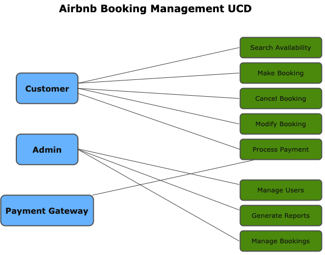

# What is Requirement Analysis?

Requirement Analysis is a foundational phase in the Software Development Lifecycle (SDLC) where developers, business analysts, and stakeholders collaborate to identify, gather, and document the needs and expectations for a new or modified software system. _**This phase serves as the blueprint for all subsequent stages of development and plays a crucial role in ensuring that the final product effectively meets user demands**_.

The process typically begins with elicitation, where information is collected through interviews, questionnaires, workshops, observations, and document reviews. This is followed by analysis and classification of the requirements into categories such as functional (what the system should do), non-functional (how the system should perform), and technical requirements. Validation and verification then ensure that the requirements are realistic, unambiguous, and aligned with business goals. Finally, documentation is prepared—often in the form of Software Requirement Specifications (SRS)—to guide developers and testers.

Requirement Analysis is crucial for several reasons. Firstly, it minimizes the risk of project failure by ensuring that the development team understands what the stakeholders truly need, rather than what they think they need. This alignment reduces costly rework and scope creep, providing a more efficient project execution. Secondly, well-analyzed requirements improve communication between technical and non-technical teams, acting as a common language. Lastly, it ensures that testing and validation can be carried out effectively, as precise requirements serve as the benchmark against which the system is evaluated.

In essence, skipping or rushing through Requirement Analysis can jeopardize the entire project. A thorough and well-executed requirements analysis phase sets the stage for building a reliable, user-centric, and successful software product.

### Why is Requirement Analysis Important?

1. **Prevents Miscommunication and Misalignment:** Requirement Analysis ensures that all stakeholders—clients, developers, designers, and testers—have a shared understanding of what the software is intended to do. Without this clarity, teams may work with different assumptions, leading to inconsistent features, rework, and dissatisfaction. By documenting clear, agreed-upon requirements, it aligns expectations from the start.

2. **Reduces Costly Errors and Rework:** Fixing a requirement-related error during or after development is far more expensive than correcting it early in the process. Through proper analysis, potential issues, ambiguities, and unrealistic goals are identified before coding begins. This early problem-solving saves time, budget, and effort by reducing the chances of scope creep and late-stage changes.

3. **Provides a Solid Foundation for Design, Development, and Testing:** Requirement Analysis acts as the blueprint for the rest of the SDLC. It informs software architecture, guides developers on what to build, and helps testers know what to verify. Without this foundation, it’s nearly impossible to track progress, measure success, or deliver a product that meets users’ needs.

### Key Activities in Requirement Analysis.

1. **Requirement Gathering:**
   
- Focuses on collecting information from stakeholders (clients, users, subject matter experts) about what they expect the system to do.

- Involves reviewing existing documentation, conducting surveys, or checking current systems (if any).

- The goal is to gather all potential requirements, even if they are vague or incomplete at this stage.

2. **Requirement Elicitation:**
   
- This is a more structured and interactive process than simple gathering.

- Techniques include interviews, workshops, brainstorming sessions, use-case analysis, and observations.

- The objective is to identify specific, relevant, and previously unmentioned needs that stakeholders might not mention unless prompted.

- Helps uncover non-obvious or conflicting requirements.

3. **Requirement Documentation:**
   
- Involves organizing and recording all gathered and elicited requirements in a clear and accessible format.

- The most common output is a Software Requirements Specification (SRS) document.

- Good documentation uses diagrams, tables, and explicit language to ensure that both technical and non-technical stakeholders can understand.

- Serves as a reference point throughout the development cycle.

4. **Requirement Analysis and Modeling:**
   
- This step involves refining and breaking down requirements to understand their feasibility, dependencies, and priorities.

- It often includes modeling techniques like flowcharts, data flow diagrams (DFDs), UML diagrams, and use cases.

- Helps detect redundant, ambiguous, or conflicting requirements.

- Supports better design decisions by visualizing the system’s behavior.

5. **Requirement Validation:**
   
- Ensures that documented requirements accurately represent stakeholder needs and are clear, complete, and testable.

- Activities include peer reviews, walkthroughs, and formal inspections.

- Helps confirm that the requirements are realistic and achievable within budget and time constraints.

- Validated requirements reduce risk by ensuring alignment before moving to design or development.

### Types of Requirements

#### Functional Requirements:

Functional requirements describe what the system should do—the specific features, behaviors, and functions the system must perform.

**Examples for the Booking Management Project:**

1. **User Registration and Login:**

- Users must be able to create an account using email or social media.

- The system must verify the user's email before activating the account.

2. **Property Search and Filter:**

- Users must be able to search for properties by location, price range, date, number of guests, and other criteria.

- The system should allow users to filter by amenities like Wi-Fi, pool, or pet-friendly.

3. **Booking Creation:**

- Registered users must be able to book available properties for specific dates.

- The system should update the property's availability calendar after a successful booking.

4. **Booking Cancellation:**

- Users must be able to cancel bookings within the host's cancellation policy timeframe.

- Hosts must be notified immediately after a cancellation.

5. **Host Management Panel:**

- Hosts must be able to list new properties, upload images, set prices, and manage availability.

6. **Payment Integration:**

- The system must process payments via credit card, PayPal, or mobile money (e.g., Flutterwave for Nigeria).

- Payment must be split between Airbnb and the host per transaction.

#### Non-Functional Requirements

Non-functional requirements describe how the system should perform, rather than specific behaviors. They address key quality attributes, including performance, usability, security, and scalability.

**Examples for the Booking Management Project:**

1. **Performance:**

- The system should load search results in under 3 seconds.

- Payment processing should not exceed 5 seconds per transaction.

2. **Scalability:**

- The system must support 100,000+ concurrent users without performance degradation.

- It should handle property listings from hosts across multiple countries.

3. **Security:**

- User data (e.g., passwords, payment details) must be encrypted using industry-standard protocols.

- The system must support secure login (e.g., two-factor authentication).

4. **Availability:**

- The system should have 99.9% uptime, especially during peak travel seasons.

- Failover mechanisms must be in place to handle server crashes.

5. **Usability:**

- The user interface must be intuitive and responsive to mobile devices.

- Booking steps should be completed in under 5 clicks or taps.

6. **Compliance:**

- The system must comply with data protection laws, such as GDPR (for EU users) and NDPR (for Nigerian users).

### Use Case Diagrams.

A Use Case Diagram is a visual representation of the interactions between users (actors) and a system. It illustrates the various ways users can interact with the system to achieve specific goals, referred to as use cases. These diagrams are a key component of the Unified Modeling Language (UML) and are used during the requirements analysis phase of software development. In simple terms, a use case diagram answers the question: **"Who will use the system and what can they do with it?"**

**Key Components of a Use Case Diagram:**

**Actors:** Represent users or external systems that interact with the application (e.g., Guest, Host, Admin).

**Use Cases:** Specific tasks the system performs for the actor (e.g., Make Booking, Cancel Reservation).

**System Boundary:** A box that defines what is inside the system and what is external.

**Relationships:**

- Association (line between actor and use case)

- Include (common behavior reused across use cases)

- Extend (optional behavior triggered under certain conditions)

**Benefits of Use Case Diagrams:**

1. **Clarity for All Stakeholders:**
   
- Use case diagrams are easy to understand, even for non-technical stakeholders.

- They provide a high-level overview of how users interact with the system.

2. **Helps in Requirement Gathering:**
   
- Helps analysts identify and organize functional requirements by visualizing user actions.

- Encourages discussion with users about system functionality.

3. **Supports System Design:**
   
- Acts as a foundation for more detailed modeling, such as activity or sequence diagrams.

- Helps developers understand what features need to be built and how users will use them.

4. **Detects Missing or Overlapping Functionality:**
   
- Reveals gaps or redundancies in user interaction or system behavior.

- Helps prioritize features by showing core vs. optional functionality.

5. **Facilitates Test Case Design:**
   
- Each use case can be translated into test scenarios, helping QA teams ensure every user function is covered.

### Acceptance Criteria

Acceptance Criteria are specific conditions that a product or feature must meet to be considered complete and acceptable by stakeholders. They serve as a bridge between requirements and testing, clearly defining what "done" means for each functionality.

**Here’s why they are essential in Requirement Analysis:**

1. **Clarifies Expectations:**
   
- Acceptance criteria remove ambiguity by defining exactly what is expected from a feature or requirement.

- They help stakeholders, developers, and testers stay aligned on the outcome.

2. **Serves as a Basis for Testing:**
   
- Each acceptance criterion becomes a test scenario.

- QA teams use them to verify whether a feature meets the agreed-upon conditions.

3. **Prevents Scope Creep:**
   
- By clearly stating what must (and must not) be included, acceptance criteria help control feature boundaries.

- This reduces the chance of unnecessary additions during development.

4. **Improves Communication Between Teams:**
   
- Developers, business analysts, and product owners all use the same set of criteria to guide development.

- This shared understanding minimizes misinterpretation of requirements.

5. **Enables Faster Sign-off:**
   
- Since the criteria define what makes a feature acceptable, product owners can quickly approve completed features if they meet the checklist.

- This streamlines the development process and promotes agile delivery.

6. **Encourages User-Centered Thinking:**
   
- Good acceptance criteria focus on user outcomes, rather than just system behavior.

- This helps ensure the product meets real-world needs, not just technical specifications.

### Feature: Checkout Process

**User Story (for context):**

As a guest, I want to securely complete a booking and make a payment so that I can confirm my stay at a chosen property.

**Acceptance Criteria:**

1. The user must be logged in to proceed to checkout.

- If not logged in, the system should redirect the user to the login page.

2. The checkout page displays a summary of the selected booking.

- Includes property name, location, price per night, total nights, service fees, and total amount.

3. The user can choose a payment method.

- Options include credit/debit card, PayPal, or a local payment gateway (e.g., Flutterwave for Nigerian users).

4. Billing and contact information must be provided and validated.

- Fields include full name, email address, phone number, and billing address.

5. The system must validate availability before completing the transaction.

- If the dates are no longer available, the user is informed, and the process is halted.

6. Payment must be processed securely and return a success/failure response.

- In the event of payment failure, the user is displayed an error message and given the opportunity to retry.

- On success, a booking confirmation is generated.

7. A booking confirmation email must be sent upon successful payment.

- Includes property details, booking ID, amount paid, and host contact information.

8. The user is redirected to a booking confirmation page after a successful checkout.

9. The host is notified of the new booking via email or in-app notification.
